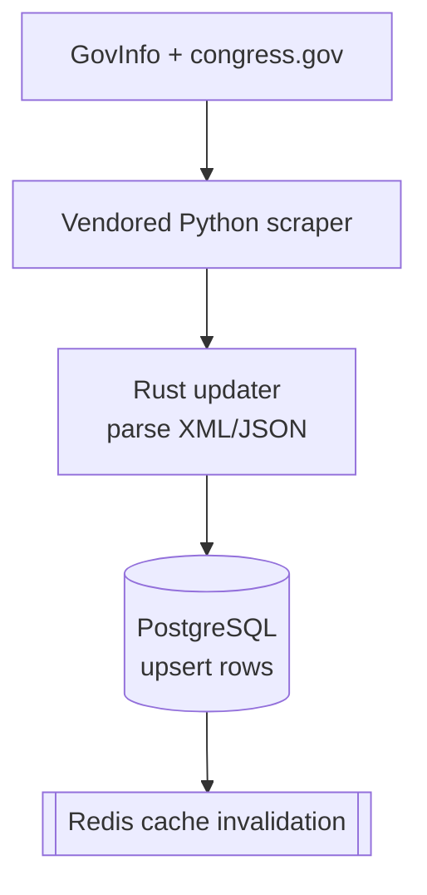
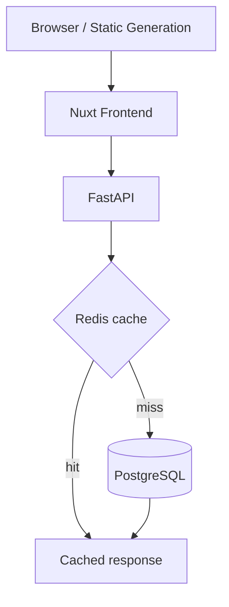
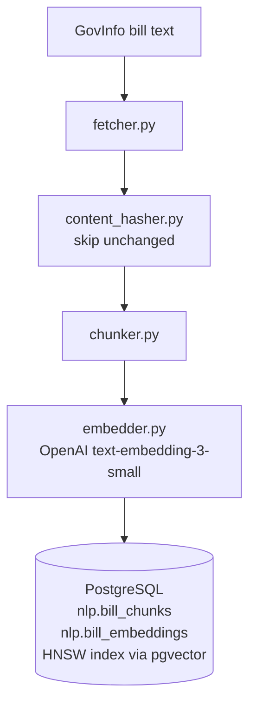

# Architecture

Runtime model for CSearch with Argo CD as the deployment strategy.

> **New here?** Start with [`README.md`](README.md), then [`docs/engineering-guide.md`](docs/engineering-guide.md) and [`docs/deployment.md`](docs/deployment.md).

## Platform Overview

| Layer | Role | Code / Manifests |
| --- | --- | --- |
| Source acquisition | Vendored Python scraper downloads raw bill/vote data | `backend/scraper/congress/` |
| Ingest | Rust updater parses raw files, writes normalized rows | `backend/scraper/` |
| Storage | PostgreSQL canonical store + pgvector for embeddings | `backend/scraper/schema.sql`, `k8s/netcup-db/` |
| API | FastAPI (Python/uvicorn) serves bills, votes, search, explore | `backend/api_fastapi/`, `k8s/netcup-core/api.yaml` |
| Cache | Redis for hot-route responses | `backend/api_fastapi/src/csearch_api/cache.py`, `k8s/netcup-core/redis.yaml` |
| NLP pipeline | Nightly job: fetch → chunk → embed → upsert into pgvector | `backend/nlp/project-tarp/`, `k8s/mars/` |
| Frontend | Nuxt public site + container variants | `frontend/`, `k8s/netcup-test-frontend/` |
| Deployment | Argo CD syncs Git-managed applications | `argo/applications/` |
| Logging | Fluent Bit ships stdout to collector or S3 | `k8s/logging/` |

---

## Data Flows

### Ingest



- Bills: 93rd Congress through current; Votes: 101st through current
- Unchanged files skipped via persisted SHA-256 hashes
- Bills and votes toggled independently with `RUN_BILLS` / `RUN_VOTES`

### Read Path



- Hot routes cached in Redis (24h TTL); falls back to Postgres if Redis is down

### NLP / Semantic Search Pipeline



- Runs nightly as `tarp-nightly-updater` CronJob in the `csearch-nlp` namespace
- Each step is idempotent — safe to re-run on failure
- Only new or changed bill text costs OpenAI API calls
- Vectors are 1536-dimensional cosine embeddings; HNSW index updated incrementally

---

## Runtime Components

### Database

**Manifests:** [`k8s/netcup-db/`](k8s/netcup-db/) -- synced by [`csearch-netcup-db.yaml`](argo/applications/csearch-netcup-db.yaml)

Manages: `postgres-config` ConfigMap, `postgres` StatefulSet, `postgres` and `postgres-headless` Services.

The `nlp` schema lives alongside the main schema in the same Postgres instance:

```
public schema  -- bills, votes, members, committees (scraper-owned)
nlp schema     -- bill_chunks, bill_embeddings, sync_state (NLP pipeline-owned)
```

### API + Redis

**Manifests:** [`k8s/netcup-core/`](k8s/netcup-core/) -- synced by [`csearch-netcup-core.yaml`](argo/applications/csearch-netcup-core.yaml)

Manages: `csearch-api` Deployment/Service, `csearch-redis` Deployment/Service, Ingress.

The API is a **FastAPI** application running under **uvicorn** (`registry.s8njee.com/csearch-fastapi:latest`).

**Routes:**

| Method | Path | Description |
| --- | --- | --- |
| `GET` | `/health` | DB connectivity check |
| `GET` | `/search/{table}/{filter}` | Full-text bill search (relevance or date order) |
| `GET` | `/latest/{billtype}` | Latest bills by type — cached |
| `GET` | `/bills/{billtype}/{congress}/{billnumber}` | Bill detail with actions, cosponsors, votes, committees |
| `GET` | `/bills/bynumber/{number}` | All bills matching a number across congresses |
| `GET` | `/votes/{chamber}` | Latest votes by chamber — cached |
| `GET` | `/votes/search` | Vote search with optional chamber filter |
| `GET` | `/votes/detail/{voteid}` | Vote detail with member breakdown |
| `GET` | `/committees` | All committees with bill counts |
| `GET` | `/committees/{committee_code}` | Committee detail with bills |
| `GET` | `/members/{bioguide_id}` | Member profile with sponsored bills and recent votes |
| `GET` | `/explore` | List available explore queries |
| `GET` | `/explore/{query_id}` | Run parameterized explore query — cached |

- `X-Cache: HIT / MISS` header on all cacheable routes
- Structured JSON request logging to stdout
- GZip compression for responses ≥ 1KB
- CORS open (`*`) — tighten if needed

### NLP Pipeline

**Manifests:** [`k8s/mars/`](k8s/mars/) and `backend/nlp/k8s/` -- synced by `csearch-mars-core` Argo app on the freya cluster.

**Namespace:** `csearch-nlp`

The nightly updater runs as a Kubernetes CronJob and orchestrates:

1. `fetcher.py` — downloads bill text from GovInfo (skips cached)
2. `content_hasher.py` — hashes legislative text, exits early if nothing changed
3. `chunker.py` — splits bills into section-aware chunks
4. `embedder.py` — generates embeddings via OpenAI `text-embedding-3-small`, skips already-embedded chunks
5. `upserter.py` — idempotent upsert into `nlp.bill_chunks` and `nlp.bill_embeddings`

See [`backend/nlp/UPDATE.md`](backend/nlp/project-tarp/UPDATE.md) for operational details and cost estimates.

### Scraper

**Manifests:** [`k8s/netcup-scraper/`](k8s/netcup-scraper/) -- synced by [`csearch-netcup-scraper.yaml`](argo/applications/csearch-netcup-scraper.yaml)

**Schedule:** environment-specific. See [`k8s/netcup-scraper/cronjob.yaml`](k8s/netcup-scraper/cronjob.yaml) and [`k8s/mars/scraper.yaml`](k8s/mars/scraper.yaml).

- `CONGRESSDIR` points at the runtime root containing `congress/` and `data/`
- CronJob mounts host paths into `/srv/csearch/congress` and `/srv/csearch/data`
- Clears `csearch:*` Redis keys after successful writes

### Frontend

| Mode | Purpose | Key files |
| --- | --- | --- |
| Static publish | Public site on S3 + CloudFront | `frontend/deploy.sh` |
| Argo nginx | Cluster-hosted `test.csearch.org` | `k8s/netcup-test-frontend/`, Argo app manifest |

### Logging

1. API and scraper write structured JSON to stdout
2. Fluent Bit tails container logs, filters to CSearch workloads
3. Ships to the in-cluster HTTP collector or directly to S3

---

## Deployment Model

Argo CD syncs from Git state.

| Application | Cluster | Git path | Branch |
| --- | --- | --- | --- |
| `csearch-netcup-db` | netcup | `k8s/netcup-db` | `main` |
| `csearch-netcup-core` | netcup | `k8s/netcup-core` | `main` |
| `csearch-netcup-scraper` | netcup | `k8s/netcup-scraper` | `main` |
| `csearch-netcup-test-frontend` | netcup | `k8s/netcup-test-frontend` | `main` |
| `csearch-mars-core` | freya | `k8s/mars` | `fastapi-api-rewrite` |

`targetRevision` is environment-specific. Check the Argo `Application` manifest before assuming a branch target.

---

## Scraper Runtime Layout

```
<CONGRESSDIR>/
  congress/
    run.py
    data/           <-- raw downloaded source data
      <congress>/
        bills/
        votes/
  data/             <-- ingest bookkeeping
    fileHashes.rscraper.bin
    voteHashes.rscraper.bin
```

---

## Cache Details

### Redis

- 24h TTL, key prefix `csearch:`, shared across API replicas
- Survives pod restarts while Redis stays up; fails open when unavailable

| Route | Cache key pattern |
| --- | --- |
| `GET /latest/{billtype}` | `csearch:latest_bills_<billtype>` |
| `GET /votes/{chamber}` | `csearch:latest_votes_<chamber>` |
| `GET /explore/{query_id}` | `csearch:explore_<query_id>` |

### Frontend Freshness

- Public site updates when the static publish flow runs
- Argo-managed frontend updates when its image or manifest changes in Git
- A scraper run does **not** automatically refresh the public static site

---

## Sources of Truth

| Concern | Source |
| --- | --- |
| Database schema | `backend/scraper/schema.sql` |
| DB writes / schema-compat logic | `backend/scraper/src/db.rs` |
| Scraper dependencies | `backend/scraper/Cargo.toml` |
| Explore SQL | `backend/scraper/explore.sql` |
| API implementation | `backend/api_fastapi/src/csearch_api/` |
| NLP schema + pipeline | `backend/nlp/IMPLEMENTATION.md`, `backend/nlp/project-tarp/` |
| NLP operational runbook | `backend/nlp/project-tarp/UPDATE.md` |
| Deployment entry points | `argo/applications/` |
| Workload manifests | `k8s/netcup-db/`, `k8s/netcup-core/`, `k8s/netcup-scraper/`, `k8s/mars/` |

---

## Troubleshooting

**Scraper finished but public site looks stale**
- Static publish hasn't run yet
- Scraper skipped unchanged files (hashes matched)
- API cache hasn't expired for the route you're checking

**Explore SQL change doesn't show after deploy**
- Edit `backend/scraper/explore.sql` and copy to `backend/api/sql/explore.sql`, then rebuild/redeploy.

**Cache invalidation looks inconsistent**
- API pods not pointing at the same `REDIS_URL`
- Redis unavailable
- Scraper completed without changing any rows

**NLP pipeline didn't run / embeddings stale**
- Check CronJob history: `kubectl get jobs -n csearch-nlp`
- Logs at `/home/sanjee/nlp/tarp-data/logs/update-YYYY-MM-DD.log` on freya
- `content_hasher.py` may have detected no text changes and exited early (expected)

**Logging looks incomplete**
- Check workload labels include `app.kubernetes.io/name`
- Fluent Bit grep filter still matches workload names
