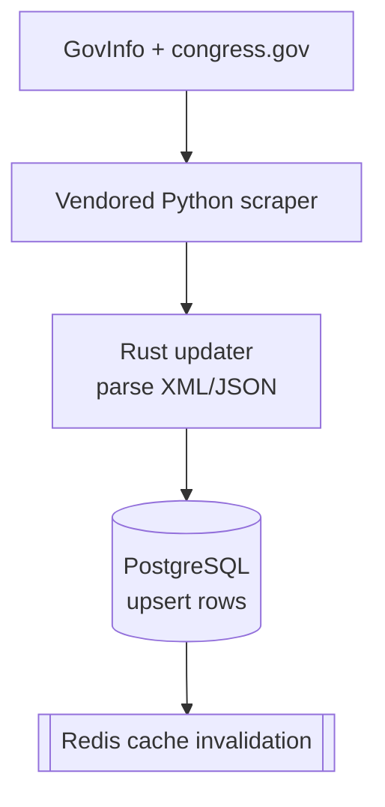
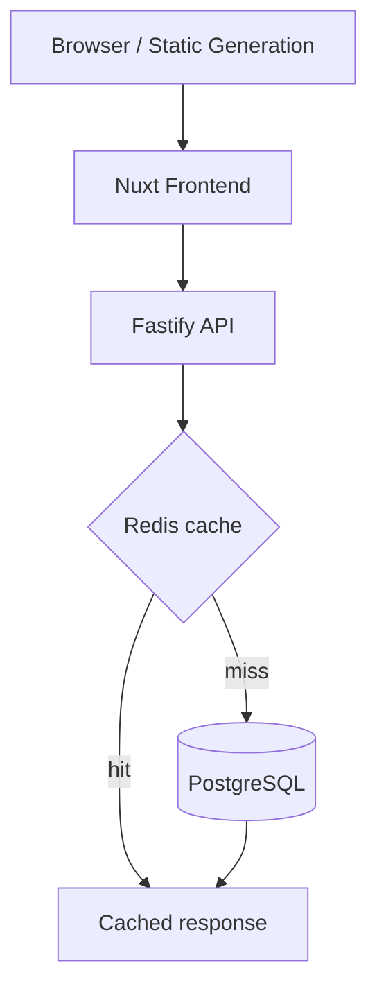

# Architecture

Runtime model for CSearch with Argo CD as the deployment strategy.

> **New here?** Start with [`README.md`](README.md), then [`docs/engineering-guide.md`](docs/engineering-guide.md) and [`docs/deployment.md`](docs/deployment.md).

## Platform Overview

| Layer | Role | Code / Manifests |
| --- | --- | --- |
| Source acquisition | Vendored Python scraper downloads raw bill/vote data | `backend/scraper/congress/` |
| Ingest | Rust updater parses raw files, writes normalized rows | `backend/scraper/` |
| Storage | PostgreSQL canonical store | `backend/scraper/schema.sql`, `k8s/netcup-db/` |
| API | Fastify serves bills, votes, search, explore | `backend/api/`, `k8s/netcup-core/api.yaml` |
| Cache | Redis for hot-route responses | `backend/api/utils/cache.js`, `k8s/netcup-core/redis.yaml` |
| Frontend | Nuxt public site + container variants | `frontend/`, `k8s/netcup-test-frontend/` |
| Deployment | Argo CD syncs Git-managed applications | `argo/applications/` |
| Logging | Fluent Bit ships stdout to collector or S3 | `k8s/logging/` |

---

## Data Flows

### Ingest



- Bills: 93rd Congress through current; Votes: 101st through current
- Unchanged files skipped via persisted SHA-256 hashes
- Bills and votes toggled independently with `RUN_BILLS` / `RUN_VOTES`

### Read Path



- Hot routes cached in Redis (24h TTL); falls back to Postgres if Redis is down

---

## Runtime Components

### Database

**Manifests:** [`k8s/netcup-db/`](k8s/netcup-db/) -- synced by [`csearch-netcup-db.yaml`](argo/applications/csearch-netcup-db.yaml)

Manages: `postgres-config` ConfigMap, `postgres-schema` generated ConfigMap, `postgres` StatefulSet, `postgres` and `postgres-headless` Services.

### API + Redis

**Manifests:** [`k8s/netcup-core/`](k8s/netcup-core/) -- synced by [`csearch-netcup-core.yaml`](argo/applications/csearch-netcup-core.yaml)

Manages: `csearch-api` Deployment/Service, `csearch-redis` Deployment/Service, `api.csearch.org` Ingress.

- Health: `GET /health` (verifies DB connectivity)
- Structured JSON logging to stdout
- Shared Redis cache across replicas (not per-pod in-memory)

### Scraper

**Manifests:** [`k8s/netcup-scraper/`](k8s/netcup-scraper/) -- synced by [`csearch-netcup-scraper.yaml`](argo/applications/csearch-netcup-scraper.yaml)

**Schedule:** daily at midnight CT (`0 0 * * *`, `America/Chicago`)

- `CONGRESSDIR` points at the runtime root containing `congress/` and `data/`
- CronJob mounts `/root/congress` into the container
- Clears `csearch:*` Redis keys after successful writes

### Frontend

| Mode | Purpose | Key files |
| --- | --- | --- |
| Static publish | Public site on S3 + CloudFront | `frontend/deploy.sh` |
| Argo nginx | Cluster-hosted `test.csearch.org` | `k8s/netcup-test-frontend/`, Argo app manifest |
| Deploy container | Scheduled static publishing | `frontend/Dockerfile.deploy`, `frontend/deploy-container.sh`, `k8s/frontend/deploy-cronjob.yaml` |

### Logging

1. API and scraper write structured JSON to stdout
2. Fluent Bit tails container logs, filters to CSearch workloads
3. Ships to the in-cluster HTTP collector or directly to S3

Grafana/Loki dashboards in `k8s/logging/dashboards/` are optional, not part of the default deployment.

---

## Deployment Model

Argo CD syncs from Git state.

| Application | Git path | Sync wave |
| --- | --- | --- |
| `csearch-netcup-db` | `k8s/netcup-db` | `-10` |
| `csearch-netcup-core` | `k8s/netcup-core` | `0` |
| `csearch-netcup-scraper` | `k8s/netcup-scraper` | `10` |
| `csearch-netcup-test-frontend` | `k8s/netcup-test-frontend` | default |

All netcup Argo applications currently target `targetRevision: codex/claude`.

---

## Scraper Runtime Layout

```
<CONGRESSDIR>/
  congress/
    run.py
    data/           <-- raw downloaded source data
      <congress>/
        bills/
        votes/
  data/             <-- ingest bookkeeping
    fileHashes.gob
    voteHashes.gob
```

---

## Cache Details

### Redis

- 24h TTL, key prefix `csearch:`, shared across API replicas
- Survives pod restarts while Redis stays up; fails open when unavailable

| Route | Cache key pattern |
| --- | --- |
| `GET /latest/:billtype` | `csearch:latest_bills_<billtype>` |
| `GET /votes/:chamber` | `csearch:latest_votes_<chamber>` |
| `GET /explore/:queryId` | `csearch:explore_<queryId>` |

### Frontend Freshness

- Public site updates when the static publish flow runs
- Argo-managed frontend updates when its image or manifest changes in Git
- A scraper run does **not** automatically refresh the public static site

---

## Sources of Truth

| Concern | Source |
| --- | --- |
| Database schema | `backend/scraper/schema.sql` |
| DB writes / schema-compat logic | `backend/scraper/src/db.rs` |
| Scraper dependencies | `backend/scraper/Cargo.toml` |
| Explore SQL | `backend/scraper/explore.sql` |
| API cache implementation | `backend/api/utils/cache.js` |
| Deployment entry points | `argo/applications/` |
| Workload manifests | `k8s/netcup-db/`, `k8s/netcup-core/`, `k8s/netcup-scraper/`, `k8s/netcup-test-frontend/` |

---

## Troubleshooting

**Scraper finished but public site looks stale**
- Static publish hasn't run yet
- Scraper skipped unchanged files (hashes matched)
- API cache hasn't expired for the route you're checking

**Explore SQL change doesn't show after deploy**
- Was it only changed in `backend/api/sql/explore.sql`? That file is a copy. Edit `backend/scraper/explore.sql` and rebuild/redeploy.

**Cache invalidation looks inconsistent**
- API pods not pointing at the same `REDIS_URL`
- Redis unavailable
- Scraper completed without changing any rows

**Logging looks incomplete**
- Check workload labels include `app.kubernetes.io/name`
- Fluent Bit grep filter still matches workload names
- Required env vars set for the chosen logging mode
- `/root/logs` writable if using the tiny collector path
