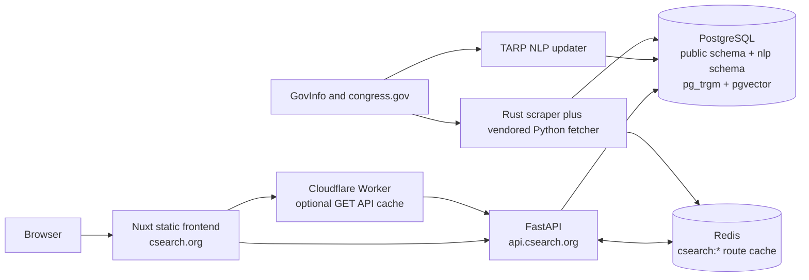
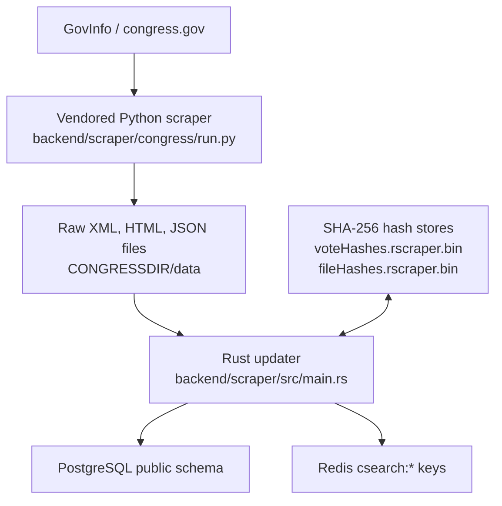
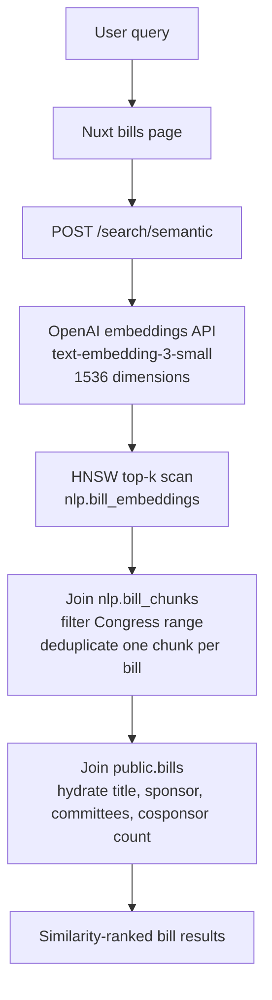
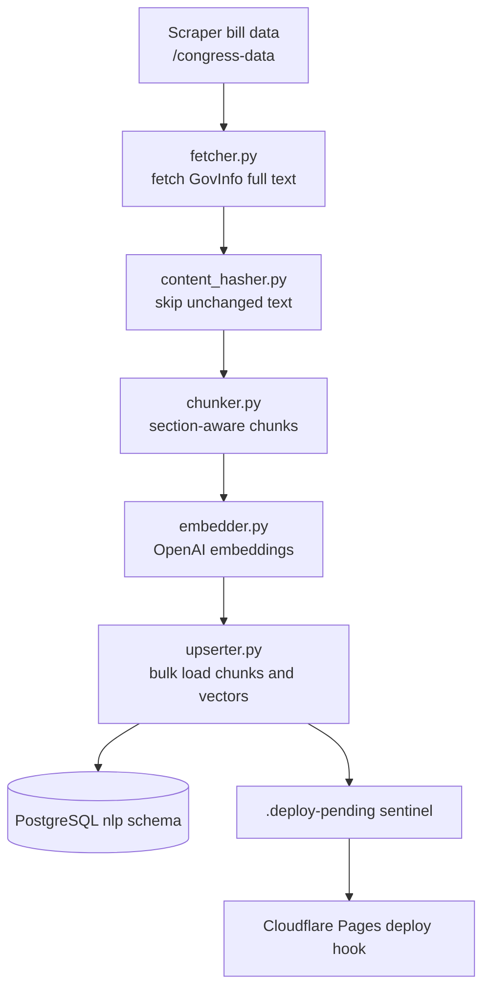

# CSearch Architecture

CSearch ingests U.S. congressional bill and vote data, stores it in PostgreSQL,
serves it through a FastAPI read API, and presents it through a generated Nuxt
frontend. Semantic search is implemented with OpenAI embeddings stored in
PostgreSQL through `pgvector`; PostgreSQL is both the relational database and
the vector database.

This document describes the architecture reflected by the current repository.
The active repo-managed path uses PostgreSQL + `pgvector` for vectors, Argo CD
for cluster workloads, and Cloudflare Pages for the public static frontend.

## System Overview

```mermaid
flowchart LR
    sources["GovInfo and congress.gov"]
    scraper["Rust scraper plus vendored Python fetcher"]
    nlp["TARP NLP updater"]
    pg[("PostgreSQL\npublic schema + nlp schema\npg_trgm + pgvector")]
    redis[("Redis\ncsearch:* route cache")]
    api["FastAPI\napi.csearch.org"]
    worker["Cloudflare Worker\noptional GET API cache"]
    frontend["Nuxt static frontend\ncsearch.org"]
    browser["Browser"]

    sources --> scraper
    scraper --> pg
    scraper --> redis
    sources --> nlp
    nlp --> pg
    api --> pg
    api <--> redis
    browser --> frontend
    frontend --> worker
    worker --> api
    frontend --> api
```

## Repository Map

| Path | Role |
| --- | --- |
| `backend/scraper/` | Rust ingest pipeline. Calls vendored Python scraper, parses source files, upserts normalized rows, and clears API cache keys after writes. |
| `backend/scraper/congress/` | Vendored `@unitedstates/congress` Python scraper code used to fetch raw bill and vote files. |
| `backend/api/` | FastAPI read API. Owns REST routes, async PostgreSQL access, Redis cache access, and semantic search. |
| `backend/nlp/project-tarp/` | Bill text fetch/chunk/embed/upsert pipeline for the semantic index. |
| `frontend/` | Nuxt 4 static frontend. Generated site deployed publicly; nginx image used for cluster test/frontend environments. |
| `workers/api-cache/` | Cloudflare Worker that can sit in front of the API and cache GET requests in KV. |
| `k8s/` | Kubernetes manifests consumed by Argo CD. |
| `argo/applications/` | Argo CD `Application` objects for netcup and freya. |
| `docs/archive/` and `k8s/archive/` | Historical notes and archive pointers; not deployment inputs. |

## Runtime Environments

| Environment | Purpose | Argo branch | Main paths |
| --- | --- | --- | --- |
| netcup | Production API, database, scraper/NLP pipeline, test frontend | `main` | `k8s/netcup-db`, `k8s/netcup-core`, `k8s/netcup-scraper`, `k8s/netcup-test-frontend` |
| freya | Development/secondary API, database, scraper/NLP pipeline, frontend | `freya` | `k8s/freya-db`, `k8s/freya-core`, `k8s/freya-scraper`, `k8s/freya-frontend` |

The active Argo applications all enable `prune` and `selfHeal`, so durable
cluster changes should be made through git rather than manual `kubectl` edits.

## Data Ingestion

### Scraper Flow

```mermaid
flowchart TD
    gov["GovInfo / congress.gov"]
    py["Vendored Python scraper\nbackend/scraper/congress/run.py"]
    raw["Raw XML, HTML, JSON files\nCONGRESSDIR/data"]
    rust["Rust updater\nbackend/scraper/src/main.rs"]
    hashes["SHA-256 hash stores\nvoteHashes.rscraper.bin\nfileHashes.rscraper.bin"]
    db["PostgreSQL public schema"]
    cache["Redis csearch:* keys"]

    gov --> py --> raw --> rust
    hashes <--> rust
    rust --> db
    rust --> cache
```

The scraper is a Rust binary that orchestrates two pipelines:

- `RUN_BILLS=true` calls the Python bill fetch task, parses bill XML/JSON, and
  writes bills, actions, cosponsors, subjects, and committees.
- `RUN_VOTES=true` calls the Python vote fetch task, parses vote JSON, and
  writes votes and member positions.

The configured ranges are:

- Bills: 93rd Congress through the dynamically computed current Congress.
- Votes: 101st Congress through the dynamically computed current Congress.

The scraper computes the current Congress as `(year - 1789) / 2 + 1`. It also
ensures future bill partitions exist, so a long-running database can cross into
a new Congress without manual partition creation.

### Change Detection

Raw files are hashed with SHA-256 before parsing. If the hash matches the
persisted hash store, the file is skipped. This keeps routine runs cheap and
allows repeated CronJob runs to be idempotent.

When a run writes any rows, `backend/scraper/src/redis_cache.rs` scans and
deletes Redis keys matching `csearch:*`. Cache invalidation failure is logged
but does not fail the scraper.

### Schedules

The repo currently contains two scraper-related CronJobs per environment:

| CronJob | Path | Schedule | Purpose |
| --- | --- | --- | --- |
| `csearch-data-pipeline` | `k8s/{netcup,freya}-scraper/orchestrator-cronjob.yaml` | `0 5 * * *` America/Chicago | Runs scraper first, then the NLP updater. |
| `csearch-rscraper` | `k8s/{netcup,freya}-scraper/cronjob.yaml` | `0 10 * * *` America/Chicago | Second scraper-only run to catch later GovInfo updates. |

Both jobs use `concurrencyPolicy: Forbid`.

## Database Architecture

PostgreSQL is the system of record. The active Kubernetes database manifests
mount `k8s/{netcup,freya}-db/001-schema.sql`, which mirrors the scraper schema
for the public data model and enables both `pg_trgm` and `vector`.

### Public Schema

The public schema stores normalized congressional data:

| Table | Purpose |
| --- | --- |
| `bills` | Partitioned by Congress. One row per bill. Includes generated `search_document` for full-text search. |
| `bill_actions` | Timeline/action rows for bills. |
| `bill_cosponsors` | Cosponsor membership per bill. |
| `bill_subjects` | Subject terms per bill. |
| `committees` | Committee reference data. |
| `bill_committees` | Bill-to-committee relationships. |
| `votes` | Roll-call vote records. Includes generated `search_document`. |
| `vote_members` | Per-member vote positions. |
| `zip_districts` | ZIP to congressional district lookup, loaded by the netcup migration job. |

Search uses PostgreSQL full-text search over generated `tsvector` columns, plus
trigram fuzzy matching for longer user queries.

### NLP Schema

The semantic index lives in the same PostgreSQL database under the `nlp` schema.
The TARP upserter creates and maintains the bill vector tables:

| Table | Purpose |
| --- | --- |
| `nlp.bill_chunks` | Embedding text and metadata. Each row is a section-oriented bill chunk with bill id, Congress, bill type/number, title, status, section metadata, source hashes, and token count. |
| `nlp.bill_embeddings` | One `vector(1536)` embedding per chunk, keyed by `chunk_id`, with the embedding model name. |

The root `schema.sql` dump includes the current `nlp` table shape and HNSW
index. The pipeline code can also create the schema from scratch through
`backend/nlp/project-tarp/upserter.py`.

`upserter.py` also contains a `--mode votes` path for future `nlp.vote_chunks`
and `nlp.vote_embeddings`, but the production API route currently searches bill
embeddings.

## API Architecture

The API is a FastAPI app in `backend/api/src/csearch_api/`.

Core runtime pieces:

- `main.py` creates the app, installs JSON request logging, CORS, gzip, proxy
  header support, and exception handlers.
- `db.py` manages an `asyncpg` pool.
- `cache.py` wraps Redis with fail-open behavior.
- `routes/` contains route modules for bills, votes, members, committees,
  representatives, explore queries, and semantic search.
- `settings.py` loads environment variables with `pydantic-settings`.

The Kubernetes API deployment is exposed inside the cluster as `csearch-api`
and publicly on netcup through the `api.csearch.org` ingress.

### API Read Paths

| Route family | Backing data | Cache behavior |
| --- | --- | --- |
| `/latest/{billtype}` | `public.bills` | Redis, 24 hour default TTL |
| `/search/{table}/{filter}` | `public.bills` full-text + trigram | Not Redis cached |
| `/bills/{billtype}/{congress}/{billnumber}` | Bill plus actions, cosponsors, votes, committees | Edge cache headers |
| `/bills/bynumber/{number}` | Matching bills across types/congresses | Not Redis cached |
| `/votes/{chamber}` | Recent votes and member counts | Redis, 24 hour default TTL |
| `/votes/search` | Vote full-text + trigram | Not Redis cached |
| `/votes/detail/{voteid}` | Vote plus member breakdown | Not Redis cached |
| `/members/{bioguide_id}` | Member profile and related records | Not Redis cached |
| `/committees` and `/committees/{code}` | Committee lists and details | Not Redis cached |
| `/representatives/{zip}` | ZIP district lookup | Not Redis cached |
| `/explore` and `/explore/{query_id}` | Predefined analytical SQL | Explore results cached for 12 hours |
| `/search/semantic` | OpenAI embedding + pgvector similarity | Not Redis cached |

Redis keys are prefixed with `csearch:`. Redis outages produce cache misses,
not request failures.

## Semantic Search and RAG Vector Database

The semantic search path is the production RAG retrieval layer. It retrieves
grounding chunks and hydrated bill metadata, but the user-facing FastAPI route
does not currently generate an LLM answer. The answer-generation experiment
lives in `backend/nlp/project-tarp/query.py`.

### Query-Time Flow

```mermaid
flowchart TD
    user["User query"]
    frontend["Nuxt bills page"]
    api["POST /search/semantic"]
    embed["OpenAI embeddings API\ntext-embedding-3-small\n1536 dimensions"]
    topk["HNSW top-k scan\nnlp.bill_embeddings"]
    chunks["Join nlp.bill_chunks\nfilter Congress range\ndeduplicate one chunk per bill"]
    bills["Join public.bills\nhydrate title, sponsor, committees, cosponsor count"]
    results["Similarity-ranked bill results"]

    user --> frontend --> api --> embed --> topk --> chunks --> bills --> results
```

Important implementation details:

- Request model: `query`, optional `congress_min`, optional `congress_max`, and
  optional `limit`.
- Default result limit is 50; maximum result limit is 500.
- The candidate limit is `max(500, limit * 10)`, capped at 2000.
- Query embeddings use OpenAI `text-embedding-3-small` with `dimensions=1536`.
- Vectors are passed to PostgreSQL as string literals cast to `vector`.
- The SQL first scans only `nlp.bill_embeddings` ordered by cosine distance, so
  the HNSW index can be used before joins and filters.
- Similarity is returned as `1 - (embedding <=> query_vector)`.
- `db.py` sets `hnsw.ef_search=500` inside the semantic query transaction to
  improve HNSW recall.
- The semantic database query has a 10 second timeout.

The SQL then joins the top candidates to `nlp.bill_chunks`, applies the
Congress filter, keeps the best chunk per `bill_id` with `DISTINCT ON`, joins
`public.bills`, and returns rows sorted by descending similarity.

### Warmup

`k8s/{netcup,freya}-core/semantic-warmup-cronjob.yaml` posts to
`/search/semantic/warmup` every five minutes. The API embeds the fixed query
`bills about climate`, caches that embedding in process, and runs a one-row
semantic search. This keeps the OpenAI client path and pgvector HNSW index warm.

### What Is RAG Here?

The retrieval unit is a bill chunk in `nlp.bill_chunks`; the final UI unit is a
bill. That gives the system a RAG-ready context layer:

1. Retrieve the nearest chunks from `nlp.bill_embeddings`.
2. Use chunk text plus section metadata as grounding context.
3. Join to `public.bills` for canonical bill metadata.
4. Optionally pass the retrieved chunks to an answer model.

Step 4 is implemented for experimentation in `backend/nlp/project-tarp/query.py`
using `gpt-5.4-nano`, but it is not part of the public FastAPI route today.

### Vector Store Choice

The vector database is PostgreSQL with `pgvector`, not a separate service.
This avoids running a second persistence tier and allows SQL joins between
vectors, chunks, and normalized bill metadata.

## NLP Embedding Pipeline

The active repo-managed NLP path is the `nlp-updater` container inside the
unified `csearch-data-pipeline` CronJob.

```mermaid
flowchart TD
    data["Scraper bill data\n/congress-data"]
    fetch["fetcher.py\nfetch GovInfo full text"]
    hash["content_hasher.py\nskip unchanged text"]
    chunk["chunker.py\nsection-aware chunks"]
    embed["embedder.py\nOpenAI embeddings"]
    upsert["upserter.py\nbulk load chunks and vectors"]
    pg[("PostgreSQL nlp schema")]
    sentinel[".deploy-pending sentinel"]
    deploy["Cloudflare Pages deploy hook"]

    data --> fetch --> hash --> chunk --> embed --> upsert --> pg
    upsert --> sentinel --> deploy
```

The orchestrator runs the Rust scraper first, then computes
`PG_CONNECTION_STRING` from the database env vars and runs
`backend/nlp/project-tarp/nightly_update.sh`.

Pipeline stages:

1. `fetcher.py` downloads bill text from GovInfo and skips bills whose metadata
   cache already exists.
2. `content_hasher.py` strips XML attributes, hashes meaningful legislative
   text, and exits early when nothing changed.
3. `chunker.py` rewrites the current Congress chunks. It deduplicates exact
   duplicate documents and sections, uses token-aware splitting, and emits JSONL
   shards under `processed_chunks`.
4. `embedder.py` embeds only missing chunk identities and writes mirrored JSONL
   shards under `embedded_chunks`.
5. `upserter.py` stages each embedded shard, deletes old rows for affected
   bill ids, inserts fresh `nlp.bill_chunks`, inserts `nlp.bill_embeddings`,
   and optionally builds or rebuilds the HNSW index.

Nightly runs pass `--skip-hnsw`; pgvector maintains the HNSW index
incrementally as new rows are inserted. Full rebuilds can be run with
`upserter.py --index-only` when operationally needed.

## Frontend Architecture

The frontend is a Nuxt 4 static site in `frontend/`.

Key pieces:

- `nuxt.config.ts` defines the static prerender routes and the default
  `NUXT_API_SERVER`, which falls back to `https://api.csearch.org`.
- `public/runtime-config.js` and `composables/useApiBase.ts` allow the API
  origin to be injected at runtime by the nginx container entrypoint.
- `composables/useCongressApi.ts` centralizes API calls.
- `pages/bills/[category]/index.vue` uses semantic search when a query is
  present and latest-bill browsing when no query is present.

Semantic frontend behavior:

- The bill list calls `POST /search/semantic` with `limit=50`.
- The request has a 10 second timeout and one retry for timeout-like failures.
- Non-timeout semantic failures fall back to `/search/all/relevance`.
- Semantic rows are normalized into the standard `BillRecord` shape and shown
  with similarity-score badges.

The active public deployment automation in this repo is Cloudflare Pages:

- `frontend/deploy.sh` runs `npm run generate`, writes `meta.json`, and deploys
  `.output/public` with Wrangler.
- `.github/workflows/frontend-cloudflare-deploy.yml` deploys on frontend changes,
  daily at 12:00 UTC, and by manual dispatch.
- The scraper/NLP pipeline can trigger a Cloudflare Pages deploy hook after
  successful content changes.

The nginx frontend image remains useful for cluster-hosted environments such as
`test.csearch.org`.

## API Edge Cache Worker

`workers/api-cache/` contains a Cloudflare Worker that can proxy
`api.csearch.org` behind `api-cache.csearch.org`.

Behavior:

- Caches GET requests in Workers KV.
- Uses a 5 minute fresh window and 24 hour stale-while-revalidate window.
- Passes POST/PUT/etc. through, including `POST /search/semantic`.
- Adds `X-Cache` and `X-Cache-Age` response headers.

This Worker is a frontend/API freshness backstop; it does not replace Redis.
Redis remains the in-cluster application cache used by FastAPI.

## Deployment and Operations

### Argo CD Applications

| Application | Branch | Path |
| --- | --- | --- |
| `csearch-netcup-db` | `main` | `k8s/netcup-db` |
| `csearch-netcup-core` | `main` | `k8s/netcup-core` |
| `csearch-netcup-scraper` | `main` | `k8s/netcup-scraper` |
| `csearch-netcup-test-frontend` | `rscraper` | `k8s/netcup-test-frontend` |
| `csearch-freya-db` | `freya` | `k8s/freya-db` |
| `csearch-freya-core` | `freya` | `k8s/freya-core` |
| `csearch-freya-scraper` | `freya` | `k8s/freya-scraper` |
| `csearch-freya-frontend` | `freya` | `k8s/freya-frontend` |

### Image Builds

`.github/workflows/build-images.yml` builds and pushes:

| Image | Dockerfile |
| --- | --- |
| `registry.s8njee.com/csearch-fastapi:latest` | `backend/api/Dockerfile` |
| `registry.s8njee.com/csearch-updater:latest` | `backend/scraper/Dockerfile` |
| `registry.s8njee.com/csearch-frontend:latest` | `frontend/Dockerfile.nginx` |
| `registry.s8njee.com/csearch-upserter:latest` | `backend/nlp/project-tarp/Dockerfile.upserter` |
| `registry.s8njee.com/csearch-tarp-updater:latest` | `backend/nlp/project-tarp/Dockerfile.nightly-updater` |

There is no root-level deployment script in the active tree. Use `DEPLOY.md`,
the Argo-managed paths, and `frontend/deploy.sh` for current deployment work.

### Secrets

Secrets are stored as Kubernetes Secrets or SealedSecrets, depending on the
environment and path. Important secret-backed values include:

- PostgreSQL password in `postgres-auth`.
- `OPENAI_API_KEY` via `csearch-api-openai`.
- Optional Cloudflare Pages deploy hook URL via
  `csearch-cloudflare-deploy-hook`.
- Registry pull credentials via `registry-s8njee-pull`.

Do not commit plaintext secrets.

### Logging

The scraper and API emit structured JSON logs to stdout. Kubernetes logging is
handled through manifests under `k8s/logging/`, including Fluent Bit and an
optional HTTP/S3 log shipping path.

## Architectural Invariants

- PostgreSQL is the source of truth for both relational data and vector data.
- `backend/scraper/congress/` is vendored upstream Python code; edit it only
  for fetch behavior or upstream format changes.
- Bill embeddings use `text-embedding-3-small` at 1536 dimensions. Do not mix
  dimensions in `nlp.bill_embeddings`.
- API cache keys use the `csearch:` prefix and Redis must fail open.
- The public semantic route retrieves grounded chunks and bill metadata; it
  does not generate answers in production.
- Argo-managed cluster changes should go through the watched git branch.

## Common Troubleshooting

| Symptom | Likely cause | Where to look |
| --- | --- | --- |
| Semantic search returns 503 | `OPENAI_API_KEY` missing in API pod | `k8s/{netcup,freya}-core/csearch-api-openai-sealedsecret.yaml` and API pod env |
| Semantic search is slow or empty | Missing/old `nlp.bill_embeddings`, HNSW index issue, or OpenAI latency | `backend/nlp/project-tarp/upserter.py`, `/search/semantic/warmup`, PostgreSQL `EXPLAIN` |
| Latest bills look stale | Redis cache was not invalidated, Pages build has not run, or Worker is serving stale GET cache | scraper logs, Redis keys, Cloudflare Pages deploys, `workers/api-cache/` headers |
| Scraper run does no work | File hashes match or source data has no meaningful changes | `backend/scraper/src/hashes.rs`, scraper logs |
| NLP pipeline exits early | `content_hasher.py` found no meaningful text changes | `backend/nlp/project-tarp/nightly_update.sh` logs |
| Manual `kubectl` edits disappear | Argo CD `selfHeal` reverted drift | `argo/applications/*.yaml` |
