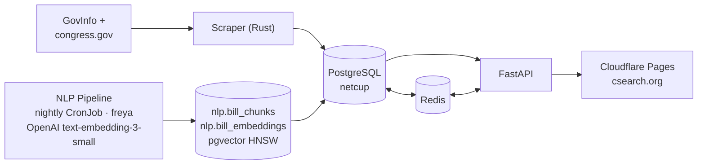

# CSearch

A monorepo for ingesting, storing, querying, and presenting U.S. congressional bill and vote data.



## What it does

- **Scraper** — Kubernetes CronJob that fetches bill and vote data from GovInfo and congress.gov, parses XML/JSON, and upserts normalized rows into Postgres. Bills from the 93rd Congress; votes from the 101st. Skips unchanged files using SHA-256 hashes.
- **Database** — PostgreSQL is the system of record. Hosts the `public` schema (bills, votes, members, committees) and the `nlp` schema (bill chunks and pgvector embeddings).
- **API** — FastAPI service (Python/uvicorn) serving bills, votes, search, member profiles, committee pages, parameterized explore queries, and semantic search. Hot routes cached in Redis.
- **NLP / Semantic Search** — Nightly pipeline (freya cluster) fetches bill text, chunks it, generates embeddings via OpenAI `text-embedding-3-small`, and upserts into `nlp.bill_embeddings`. Queries use the pgvector HNSW index for cosine similarity.
- **Frontend** — Nuxt 4 static site deployed to Cloudflare Pages. Also runs as an nginx container on the freya cluster for internal use.

## Getting started locally

```bash
# API
cd backend/api
pip install -e .
POSTGRESURI=localhost DB_USER=csearch DB_PASSWORD=... DB_NAME=csearch \
  REDIS_URL=redis://localhost:6379 \
  uvicorn csearch_api.main:app --reload --port 3000

# Frontend
cd frontend
npm install
NUXT_API_SERVER=http://localhost:3000 npx nuxt dev

# Scraper (tests only — run the full scraper via k8s CronJob)
cd backend/scraper && cargo test
```

## Repository layout

| Path | Description |
| --- | --- |
| `backend/scraper/` | Rust ingest pipeline with vendored Python scraper. Owns schema bootstrap, parsing, hash-based skip logic, and Redis cache invalidation. |
| `backend/api/` | FastAPI service (Python/uvicorn). asyncpg queries, Redis route caching, structured JSON logging. |
| `backend/nlp/` | Git submodule (`github.com/s4njee/csearch-nlp`). pgvector embedding pipeline and NLP implementation notes. |
| `frontend/` | Nuxt 4 app. Deploys to Cloudflare Pages (csearch.org) and as an nginx container for cluster environments. |
| `argo/` | Argo CD `Application` manifests — the deployment entry point. |
| `k8s/` | Kubernetes workload manifests synced by Argo. |
| `k8s/netcup-core/` | API + Redis for netcup (production). |
| `k8s/netcup-db/` | Postgres StatefulSet for netcup. |
| `k8s/netcup-scraper/` | Scraper CronJob for netcup. |
| `k8s/netcup-test-frontend/` | nginx frontend for `test.csearch.org` on netcup. |
| `k8s/mars/` | API + Redis + scraper for freya cluster. |
| `k8s/logging/` | Fluent Bit DaemonSet, collector, Grafana dashboards. |

## Key conventions

- `backend/scraper/schema.sql` is the source of truth for the database schema.
- `backend/scraper/explore.sql` is the source of truth for explore queries. The API reads a copy at `backend/api/sql/explore.sql`.
- `backend/scraper/congress/` is vendored upstream code — do not edit.
- `argo/applications/` is the deployment entry point for all environments.
- NLP embeddings use `text-embedding-3-small` (1536 dimensions). Do not mix models or dimensions in `nlp.bill_embeddings`.
- All images are pushed to `registry.s8njee.com`. CI builds on every push to `main`.
- Secrets are managed via Bitnami SealedSecrets — never commit plaintext secrets.

## Further reading

- [`ARCHITECTURE.md`](ARCHITECTURE.md) — runtime architecture, data flows, component details, caching
- [`DEPLOY.md`](DEPLOY.md) — how to build and deploy each component, CI setup, secrets
- [`backend/scraper/README.md`](backend/scraper/README.md) — scraper internals
- [`backend/nlp/`](backend/nlp/) — NLP pipeline implementation and operational notes

## License

See [`LICENSE.txt`](LICENSE.txt).
