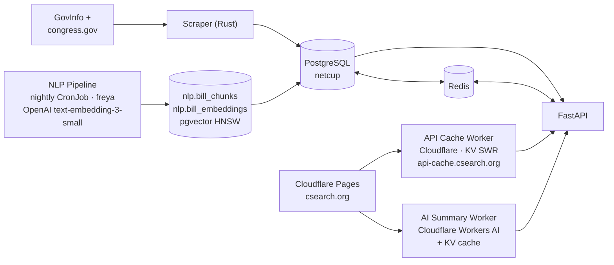

# CSearch

**A fast, searchable home for U.S. congressional bills and votes.** CSearch ingests
public legislative data from GovInfo and congress.gov, normalizes it, and serves it
through a clean web app with full-text and semantic search, member and committee
profiles, vote breakdowns, and AI-generated plain-English bill explanations.

🔗 **Live:** [csearch.org](https://csearch.org)

## Features

- **Browse** bills, votes, members, and committees with linked, cross-referenced detail pages.
- **Search** by keyword, by field, or by meaning — semantic search uses pgvector embeddings to find bills by what they're *about*, not just the words they contain.
- **Explore** the data through parameterized, ready-made analytical queries.
- **AI Explain** — one click generates a plain-English summary of any bill (what it does, who sponsors it, where it stands), powered by Cloudflare Workers AI and cached at the edge.
- **Agent-ready** — a public [MCP](https://modelcontextprotocol.io) server at `api.csearch.org/mcp` exposes the corpus as tools for LLM agents (Claude Desktop, Claude Code, or any MCP client).
- **Fresh** — a nightly pipeline keeps bills and votes up to date; public GETs are cached at the Cloudflare edge with Postgres-derived data versions.

## Connect an AI agent (MCP)

CSearch runs a public [MCP](https://modelcontextprotocol.io) server at
**`https://api.csearch.org/mcp`** (streamable HTTP) — point any MCP client at it to give
your agent live access to bills and votes. No install, account, or API key required.

**Claude Code**

```bash
claude mcp add --transport http csearch https://api.csearch.org/mcp
```

**Claude Desktop** — Settings → Connectors → **Add custom connector**, then paste
`https://api.csearch.org/mcp`.

**Codex CLI**

```bash
codex mcp add csearch --url https://api.csearch.org/mcp
```

Then just ask, e.g. *"Use csearch to find recent bills about offshore wind permitting and
summarize the top three."* Every result links back to a `csearch.org` page for citation.
To run the server locally over stdio instead, see [`backend/mcp/README.md`](backend/mcp/README.md).

## Architecture


```mermaid
flowchart LR
    src["GovInfo +\ncongress.gov"]
    scraper["Scraper (Rust)"]
    pg[("PostgreSQL\nnetcup")]
    redis[("Redis")]
    api["FastAPI"]
    cf["Cloudflare Pages\ncsearch.org"]
    nlp["NLP Pipeline\nnightly CronJob · freya\nOpenAI text-embedding-3-small"]
    nlpdata[("nlp.bill_chunks\nnlp.bill_embeddings\npgvector HNSW")]
    ai["AI Summary Worker\nCloudflare Workers AI\n+ KV cache"]
    apicache["API Cache Worker\nCloudflare · KV SWR\napi-cache.csearch.org"]

    src --> scraper --> pg --> api
    pg <--> redis <--> api
    nlp --> nlpdata --> pg
    cf --> apicache --> api
    cf --> ai --> api
```

## Components

- **Scraper** — Kubernetes CronJob that fetches bill and vote data from GovInfo and congress.gov, parses XML/JSON, and upserts normalized rows into Postgres. Bills from the 93rd Congress; votes from the 101st. Skips unchanged files using SHA-256 hashes.
- **Database** — PostgreSQL is the system of record. Hosts the `public` schema (bills, votes, members, committees) and the `nlp` schema (bill chunks and pgvector embeddings).
- **API** — FastAPI service (Python/uvicorn) serving bills, votes, search, member profiles, committee pages, parameterized explore queries, semantic search, and data-version probes for edge cache freshness. Redis remains available for internal app caching, rate limiting, and embedding cache use.
- **NLP / Semantic Search** — Nightly pipeline (freya cluster) fetches bill text, chunks it, generates embeddings via OpenAI `text-embedding-3-small`, and upserts into `nlp.bill_embeddings`. Queries use the pgvector HNSW index for cosine similarity.
- **AI Summary Worker** — Cloudflare Worker that turns a bill into a plain-English explanation on demand. It pulls the bill from the API, prompts a Llama 3.3 model via the Workers AI binding, and caches each result in Workers KV for 7 days, so repeat views are instant and cost no inference.
- **API Cache Worker** — Cloudflare Worker (`workers/api-cache/`, live at `api-cache.csearch.org`) that proxies the public API with a KV-backed stale-while-revalidate cache keyed by API path plus the origin `/cache-version` contract. Production `NUXT_API_SERVER` points at it, so the site serves GET data from the edge and moves to fresh KV keys after scraper-visible data changes. POST `/search/semantic` passes through uncached.
- **MCP Server** — FastMCP server (`backend/mcp/`) that wraps the public API and exposes legislation as tools for LLM agents over stdio or streamable HTTP. A thin client over the HTTP API, so it inherits the API's caching and rate limiting.
- **Frontend** — Nuxt 4 static site deployed to Cloudflare Pages. Also runs as an nginx container on the freya cluster for internal use.

## Getting started locally

```bash
# API
cd backend/api
pip install -e .
POSTGRESURI=localhost DB_USER=csearch DB_PASSWORD=... DB_NAME=csearch \
  REDIS_URL=redis://localhost:6379 \
  uvicorn csearch_api.main:app --reload --port 3000

# Frontend
cd frontend
npm install
NUXT_API_SERVER=http://localhost:3000 npx nuxt dev

# Scraper (tests only — run the full scraper via k8s CronJob)
cd backend/scraper && cargo test

# AI summary Worker
cd backend/ai-summary
npm install
npx wrangler dev          # local; deploy with `npm run deploy`
```

## Repository layout

| Path | Description |
| --- | --- |
| `backend/scraper/` | Rust ingest pipeline with vendored Python scraper. Owns schema bootstrap, parsing, hash-based skip logic, and Redis cache invalidation for in-cluster API caches. |
| `backend/api/` | FastAPI service (Python/uvicorn). asyncpg queries, data-version probes, Redis helpers, structured JSON logging. |
| `backend/nlp/` | Git submodule (`github.com/s4njee/csearch-nlp`). pgvector embedding pipeline and NLP implementation notes. |
| `backend/ai-summary/` | Cloudflare Worker for AI bill summaries. Workers AI inference + KV caching. Deployed with Wrangler. |
| `workers/api-cache/` | Cloudflare Worker: version-aware KV-backed SWR cache in front of the public API (`api-cache.csearch.org`). Deployed with Wrangler. |
| `backend/mcp/` | FastMCP server (`csearch-mcp`) wrapping the public API as MCP tools for LLM agents. stdio or streamable HTTP. |
| `frontend/` | Nuxt 4 app. Deploys to Cloudflare Pages (csearch.org) and as an nginx container for cluster environments. |
| `argo/` | Argo CD `Application` manifests — the deployment entry point. |
| `k8s/` | Kubernetes workload manifests synced by Argo. |
| `k8s/netcup-core/` | API + Redis for netcup (production). |
| `k8s/netcup-db/` | Postgres StatefulSet for netcup. |
| `k8s/netcup-scraper/` | Scraper CronJob for netcup. |
| `k8s/netcup-test-frontend/` | nginx frontend for `test.csearch.org` on netcup. |
| `k8s/freya-core/` | API + Redis for freya cluster (dev). |
| `k8s/freya-db/` | Postgres StatefulSet for freya. |
| `k8s/freya-scraper/` | Scraper CronJob for freya. |
| `k8s/logging/` | Fluent Bit DaemonSet, collector, Grafana dashboards. |

## Key conventions

- `backend/scraper/schema.sql` is the source of truth for the database schema.
- `backend/scraper/explore.sql` is the source of truth for explore queries. The API reads a copy at `backend/api/sql/explore.sql`.
- `backend/scraper/congress/` is vendored upstream code — do not edit.
- `argo/applications/` is the deployment entry point for all environments.
- NLP embeddings use `text-embedding-3-small` (1536 dimensions). Do not mix models or dimensions in `nlp.bill_embeddings`.
- All images are pushed to `registry.s8njee.com`. CI builds on every push to `main`.
- Secrets are managed via Bitnami SealedSecrets — never commit plaintext secrets.

## Further reading

One source-of-truth doc per topic (archived docs live under `docs/archive/`):

| Topic | Doc |
| --- | --- |
| Architecture & data freshness | [`ARCHITECTURE.md`](ARCHITECTURE.md) |
| Deploy | [`DEPLOY.md`](DEPLOY.md) |
| Local dev | [`DEV_SETUP.md`](DEV_SETUP.md) |
| Day-to-day engineering | [`docs/engineering-guide.md`](docs/engineering-guide.md) |
| Database schema & migrations | [`db/README.md`](db/README.md) |
| Product surface (Browse/Find/Search/Analyze/Answer) | [`docs/PRODUCT.md`](docs/PRODUCT.md) |
| Caching | [`docs/caching.md`](docs/caching.md) |
| Scraper internals | [`backend/scraper/README.md`](backend/scraper/README.md) |
| NLP pipeline & retrieval eval | [`backend/nlp/`](backend/nlp/), [`backend/nlp/eval/`](backend/nlp/eval/) |

## License

See [`LICENSE.txt`](LICENSE.txt).
